# Ophelia BDD Playwright Test Framework — Architecture Reference

## Project Overview

**Framework:** Playwright + Cucumber + TypeScript  
**Target:** Practice Software Testing — ToolShop Demo (practicesoftwaretesting.com)  
**Approach:** Behaviour-Driven Development (BDD) with Gherkin scenarios  
**Reporting:** Multiple Cucumber HTML Reporter + screenshots + JSON report  

---

## 1. End-to-End Workflow

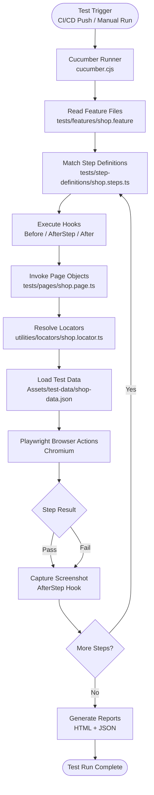

---

## 2. System Architecture

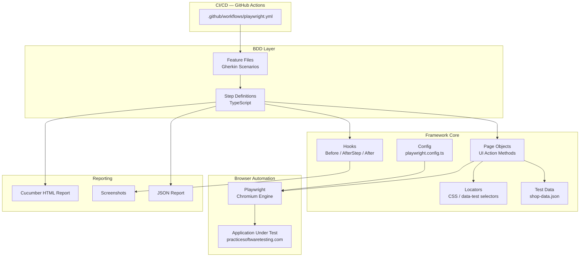

---

## 3. Project Directory Structure

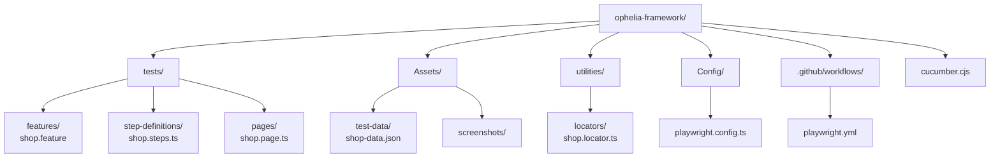

---

## 4. Component Responsibility Map

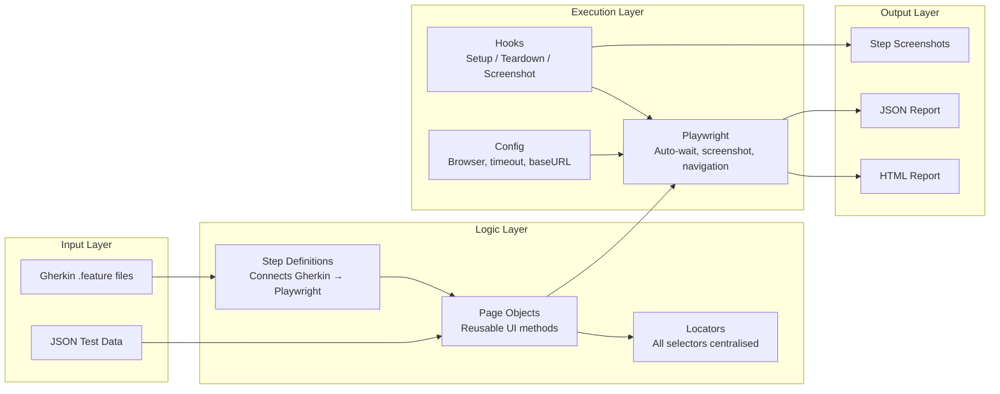

---

## 5. Module Execution Flow (Tag-Based)

```mermaid
flowchart TD
    START([npx cucumber-js]) --> TAG{Execution Tag}

    TAG -->|@smoke| M1[Module 1\nHomepage & Navigation]
    TAG -->|@login| M2[Module 2\nAuthentication]
    TAG -->|@register| M3[Module 3\nRegistration]
    TAG -->|@cart| M4[Module 4\nCart Flow]
    TAG -->|@checkout| M5[Module 5\nAuthenticated Checkout]
    TAG -->|@checkout-guest| M6[Module 6\nGuest Checkout]
    TAG -->|@regression| ALL[All Modules]

    M1 --> PASS
    M2 --> PASS
    M3 --> PASS
    M4 --> PASS
    M5 --> PASS
    M6 --> PASS
    ALL --> PASS

    PASS([Results & Report])
```

---

## 6. Module 1 — Homepage & Navigation Flow

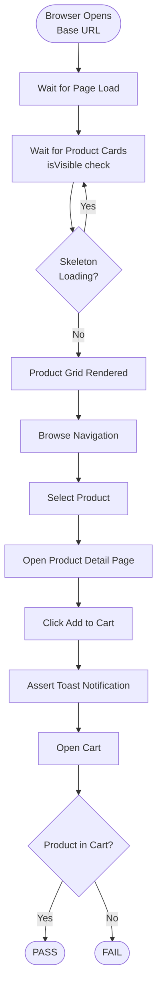

---

## 7. Module 2 — Authentication Flow

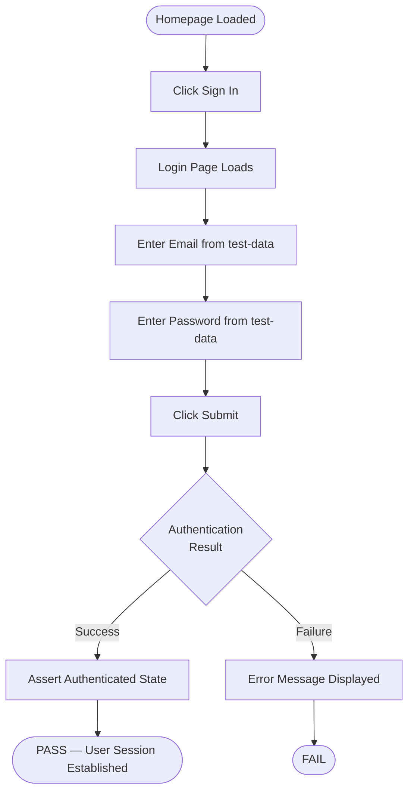

---

## 8. Module 3 — Registration Flow

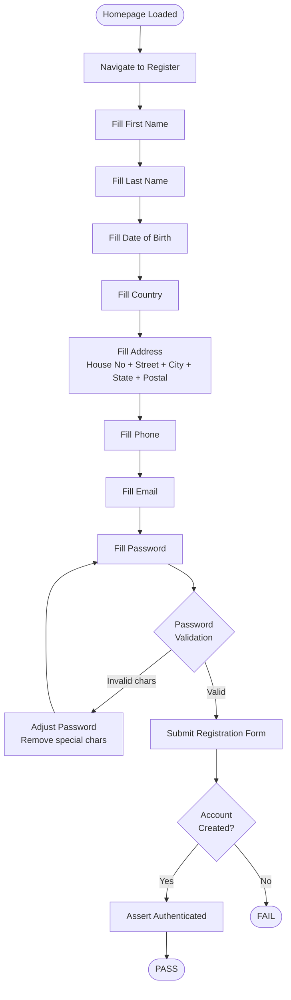

---

## 9. Module 4 — Cart Flow

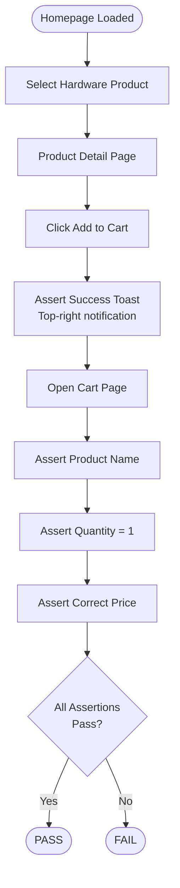

---

## 10. Module 5 — Authenticated Checkout Flow

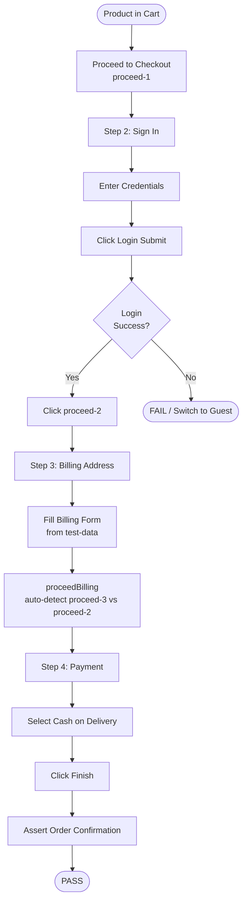

---

## 11. Module 6 — Guest Checkout Flow

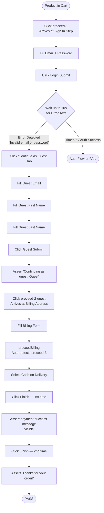

---

## 12. Screenshot Capture Hook Flow

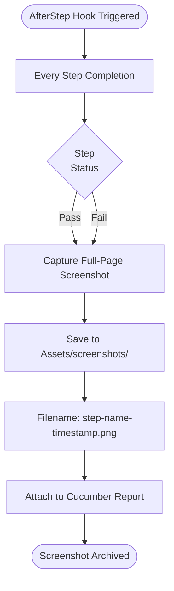

---

## 13. CI/CD Pipeline Flow

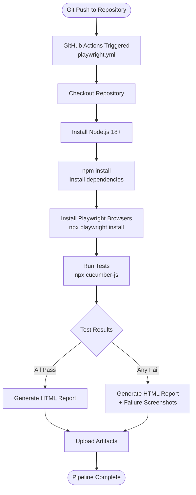

---

## 14. Test Data Flow

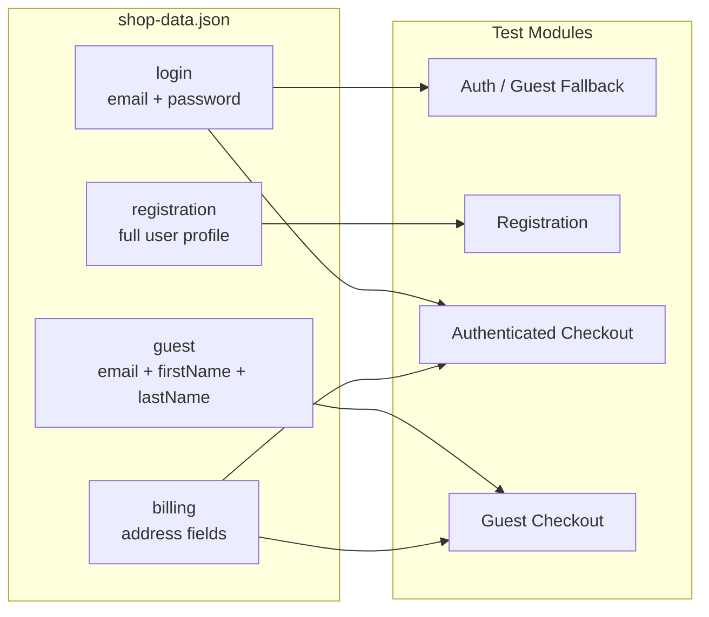

---

## 15. proceedBilling Auto-Detection Logic

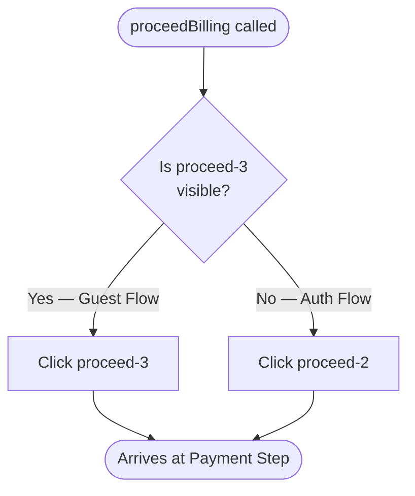

---

## 16. Acceptance Criteria Status

| ID | Criteria | Status |
|----|----------|--------|
| AC-01 | Each tagged module executes independently | Passing |
| AC-02 | Homepage loads and product grid renders within timeout | Passing |
| AC-03 | Login flow authenticates a valid user | Passing |
| AC-04 | Registration flow creates a new account | Passing |
| AC-05 | Cart flow adds product and validates contents | Passing |
| AC-06 | Authenticated checkout completes all 4 steps | Passing |
| AC-07 | Guest checkout detects login failure and falls back to guest flow | Passing |
| AC-08 | Guest checkout handles double-finish confirmation flow | Passing |
| AC-09 | Screenshots captured at every step via AfterStep hook | Passing |
| AC-10 | Cucumber HTML report generated after each run | Passing |
| AC-11 | proceedBilling auto-detects proceed-3 vs proceed-2 for guest vs auth | Passing |
| AC-12 | Framework requires only tests folder changes for a new site | Passing |